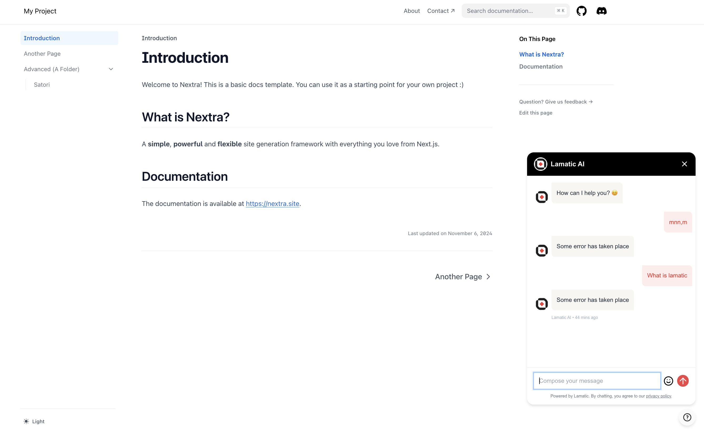

# Lamatic <> Nextra Docs Starter Kit

This is a template for creating documentation with [Nextra](https://nextra.site) and integrating it with [Lamatic](http://lamatic.ai).

[**Live Demo →**](https://nextra-docs-template.vercel.app)

[](https://nextra-docs-template.vercel.app)

## Getting Started

### 1. Clone the Repository

```bash
git clone https://github.com/your-username/lamatic-nextra-starter.git
cd lamatic-nextra-starter
```

### 2. Configure Lamatic Workflows

You'll need to set up two essential workflows on <a href="https://studio.lamatic.ai/" target="_blank" rel="noopener noreferrer">Lamatic</a>:


#### Documentation Indexing Workflow
- Creates and maintains a vector store of your Nextra documentation
- Automatically indexes new content when documentation is updated
- Enables semantic search capabilities

[Add to Lamatic](https://studio.lamatic.ai/_?templateSlug=index-github-actions) <!-- TODO: Replace with actual Lamatic onboarding URL -->

#### RAG-Enhanced Chatbot Workflow
- Implements Retrieval-Augmented Generation (RAG) for accurate responses
- Utilizes the indexed documentation to provide context-aware answers
- Handles user queries with documentation-specific knowledge

[Add to Lamatic](https://studio.lamatic.ai/_?templateSlug=document-chatbot-widget) <!-- TODO: Replace with actual Lamatic onboarding URL -->

> Refer to the [Lamatic documentation](https://lamatic.ai/docs/flows/editor) for more details.


### 3. Configure GitHub Secrets

Add the following secrets to your GitHub repository:

- `WEBHOOK_URL`: Your Lamatic webhook URL for triggering workflows
- `WEBHOOK_KEY`: (Optional) API key for secure workflow triggers

> Refer to the [Github documentation](https://docs.github.com/en/actions/security-for-github-actions/security-guides/using-secrets-in-github-actions) for more details.

### 4. Deploy on Vercel

Configure the following environment variables in your Vercel project settings:

- `NEXT_PUBLIC_LAMATIC_BOT_NAME`: Your chatbot's display name
- `NEXT_PUBLIC_LAMATIC_SUGGESTIONS`: Initial suggestions/prompts for users (comma-separated)

[](https://vercel.com/new/clone?s=https%3A%2F%2Fgithub.com%2Fyour-username%2Flamatic-nextra-starter)

## Local Development

First, run `pnpm i` to install the dependencies.

Then, run `pnpm dev` to start the development server and visit localhost:3000.

## License

This project is licensed under the MIT License.
